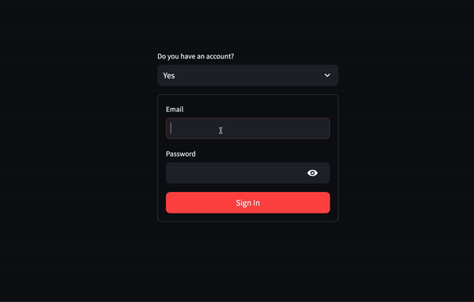

# About

A resume agent that allow users to upload a resume, then extract relevant information in JSON format using a LLM, and generate a new formatted resume

Key features:

- Authentication: Allow users to sign up and log in via email, the backend API only accept requests from logged in users
- Resume extracted in following a JSON schema instructed to the LLM
- Jinja2 template was used to generate new formatted resume
- Easily extensible. Simply add a new Jinja2 template to create a new template or look for the generated resume

# Demo



# Tech stack:

- Front end: Streamlit
- Back end:
  Python
  LangChain for prompting model to produce the JSON formatted output
  LangSmith for traceability
- Deployment: Dockerfile and Google Cloud Run for both front end and backend
- Authentication: Firebase auth

# Front End

## Streamlit + Firebase Authentication

Limitation: Due to Streamlit's current limitation with setting and persisting cookies, authentication state is only persisted within the same session. If the user reload the page, they will be logged out.

Credit to [cmayoracurzio/streamlit_firebase_auth repo](https://github.com/cmayoracurzio/streamlit_firebase_auth) for the authentication code

## Secrets and credentials for frontend

The application rely on credentials in ./resume-agent-frontend/.streamlit/secrets.toml

Example content of secrets.toml:

```
FIREBASE_WEB_API_KEY = "YOUR_FIREBASE_API_KEY"
SERVER_URL = "https://link-to-back-end-api"
```

You can obtain FIREBASE_WEB_API_KEY from Firebase console upon creating your project in the console.

**Note:** Remember to add your Firebase project Web API key to the .streamlit/secrets.toml... **and keep it a secret!**

SERVER_URL is the link to the back end part of the app which will be available after you deploy the back end to the google cloud run or locally

## Running front end app locally:

To build the image:

`docker build -t resume-agent-frontend .`

To run the image and make it available in localhost:8501

`docker run -p 8501:8501 resume-agent-frontend`

## Deploy the front end app to Cloud Run

`cd resume-agent-frontend && gcloud run deploy resume-agent-frontend --source . --port 8501 --allow-unauthenticated --region us-central1`

# Backend

## Run the backend API locally without Docker

`poetry run langchain serve --port=8000`

- This will expose the routes defined in ./resume-agent-backend/server.py
- The only route available without authentication is localhost:8000/docs which is generated by FastAPI, useful to check the available end points
- For testing purposes, you can turn off authentication by removing dependencies when defining the app in server.py `dependencies=[Depends(get_current_user)]`
- You can obtain the token of a signed in user by printing out `st.session_state.id_token` when a user log in and pass it as Authorization Bearer to the request to the API
- Example request

```
curl -X POST \
 -H "Authorization: Bearer your_token_here" \
 -F "file=@/your-valid-path/john_doe.pdf" \
 http://localhost:8080/upload_pdf
```

## To run locally with Docker

`docker build -t backend .`

then

```
docker run \
 -e OPENAI_API_KEY=$OPENAI_API_KEY \
    -e LANGCHAIN_API_KEY=$LANGCHAIN_API_KEY_RESUME_AGENT \
 -e GOOGLE_APPLICATION_CREDENTIALS='/app/service-account-file.json' \
 -v /path-on-local/service-account-file.json:/app/service-account-file.json \
 -p 8080:8080 \
 backend
```

## To deploy on Google Cloud Run

`gcloud run deploy resume-agent --source . --port 8080 --allow-unauthenticated --region us-central1 --set-env-vars=OPENAI_API_KEY=$OPENAI_API_KEY,LANGCHAIN_API_KEY=$LANGCHAIN_API_KEY_RESUME_AGENT`

Make sure the keys are available in your environment where this command is run, alternatively you can pass the key to the command directly when spinning up cloud run.

The above method might require your profile to have cloudbuild.editor IAM access . An alternative:

```
gcloud builds submit --tag gcr.io/your-gcloud-project-id/resume-agent-frontend --project=resume-agent-42690
gcloud run deploy --image gcr.io/your-gcloud-project-id/resume-agent-frontend --platform managed --project=resume-agent-426904 --allow-unauthenticated
```
